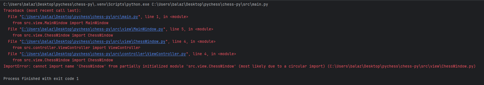
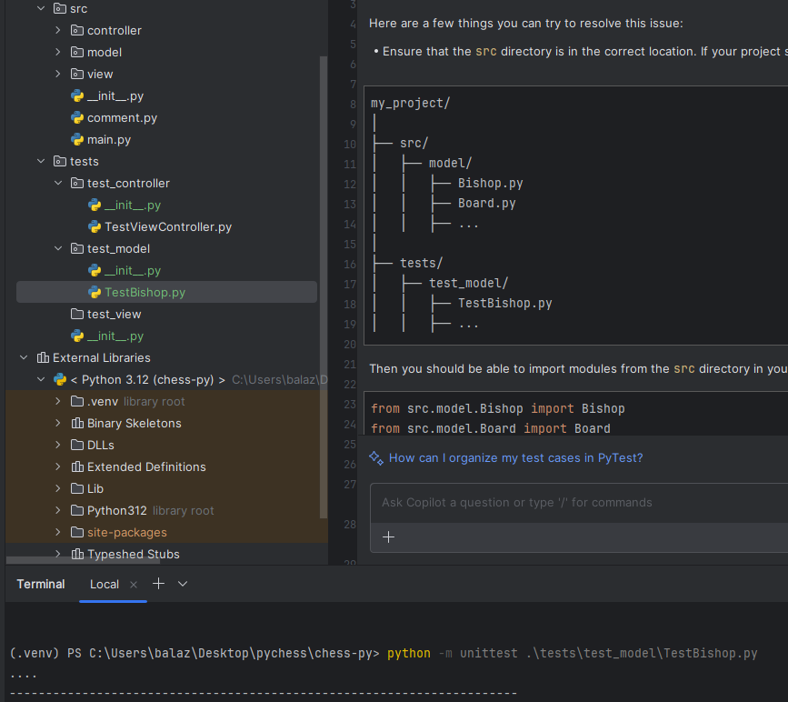

# Problems and solutions


## Number 1:

~~~bash
_tkinter.TclError: image "pyimage3" doesn't exist
~~~

### **Description:**

This error occured when I tried to add a background image to the buttons.


### **Solution:**

https://stackoverflow.com/questions/20251161/tkinter-tclerror-image-pyimage3-doesnt-exist

In ChessWindow.py, I changed the line...
~~~python
wlcm_scrn = tkinter.Tk()
~~~
to this...
~~~python
wlcm_scrn = tkinter.Toplevel()
~~~


## Number 2:

### **Description:**



~~~bash
File "C:\Users\balaz\Desktop\pychess\chess-py\src\controller\ViewController.py", line 4, in <module>
    from src.view.ChessWindow import ChessWindow
ImportError: cannot import name 'ChessWindow' from partially initialized module 'src.view.ChessWindow' (most likely due to a circular import) (C:\Users\balaz\Desktop\pychess\chess-py\src\view\ChessWindow.py)
~~~

### **Solution:**

I had to change the import statement in ViewController.py from this...
~~~python
from src.view.ChessWindow import ChessWindow
~~~
to this...
```python
import src.view.ChessWindow as ChessWindow
```
### But then it is necessary to change the type hinting:

```python
def __init__(self, chess_window: ChessWindow.ChessWindow, white_player_name: str, black_player_name: str):
    self._chess_gui: ChessWindow.ChessWindow = chess_window
```


## Number 3:

### **Description:**

Running test from command line with the following command:

Have to be in the root directory of the project to run the tests.
```
python -m unittest .\tests\test_model\TestBishop.py
```